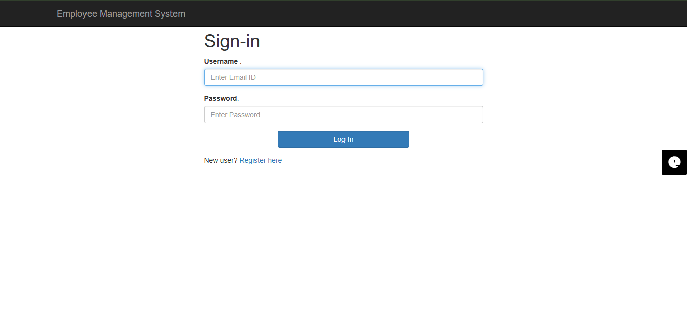
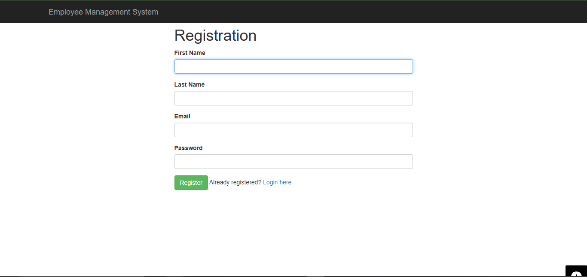
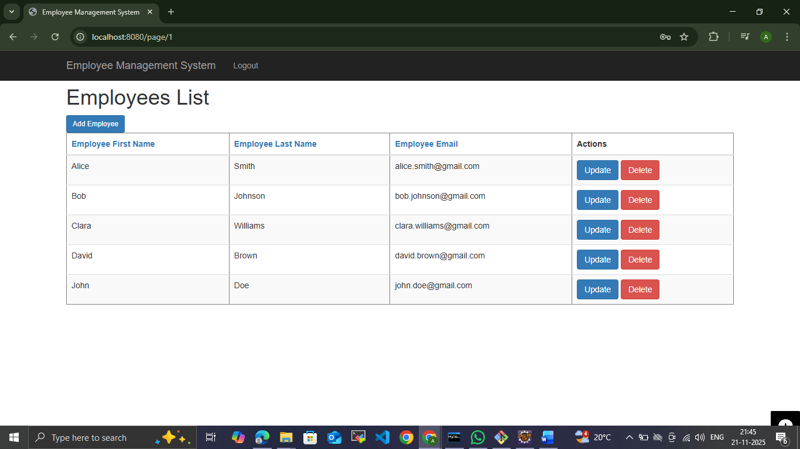
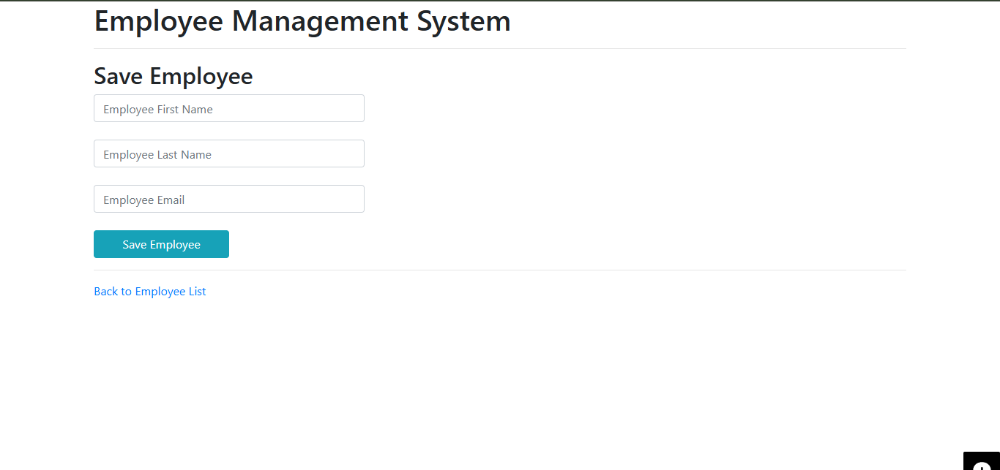

# Employee Management System

A **Spring Boot + Thymeleaf + Spring Security + MySQL** web application that provides a complete Employee Management System with **user authentication** and **CRUD operations**.


---

## 🚀 Features

### 🔐 User Authentication
- User Registration  
- Secure Login (Spring Security)  
- Password encryption using BCrypt  

### 👨‍💼 Employee Management (CRUD)
- Add Employee  
- View Employee List  
- Update Employee  
- Delete Employee  
- Pagination & Sorting  

### 🎨 Frontend
- Thymeleaf templates  
- Clean and simple UI  

---

## 🛠 Technologies Used

| Layer       | Technology |
|-------------|------------|
| Backend     | Spring Boot, Spring MVC, Spring Data JPA |
| Security    | Spring Security, BCrypt |
| Frontend    | HTML, CSS, Thymeleaf |
| Database    | MySQL |
| Build Tool  | Maven |
| IDE         | Eclipse |

---

## 📸 Screenshots

### 🔐 Sign In  


### 📝 Registration  


### 📋 Employee List  


### ➕ Add Employee  


### ✏️ Update Employee  


---

## ⚙️ How to Run the Project

### 1️⃣ Clone the repository
```bash
git clone https://github.com/HumeraSK/employee-management-webapp.git
```

### 2️⃣ Import into Eclipse  
**File → Import → Maven → Existing Maven Project**

### 3️⃣ Create MySQL Database
```sql
CREATE DATABASE employee_management;
```

### 4️⃣ Update MySQL credentials in `application.properties`
```
spring.datasource.url=jdbc:mysql://localhost:3306/employee_management
spring.datasource.username=YOUR_USERNAME
spring.datasource.password=YOUR_PASSWORD
```

### 5️⃣ Run the project  
Run the main class:
```
EmployeeManagementWebappApplication.java
```

### 6️⃣ Open in Browser
```
http://localhost:8080/login
```

---
